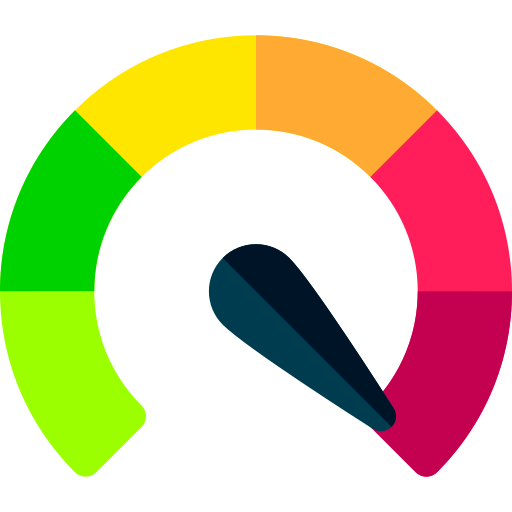
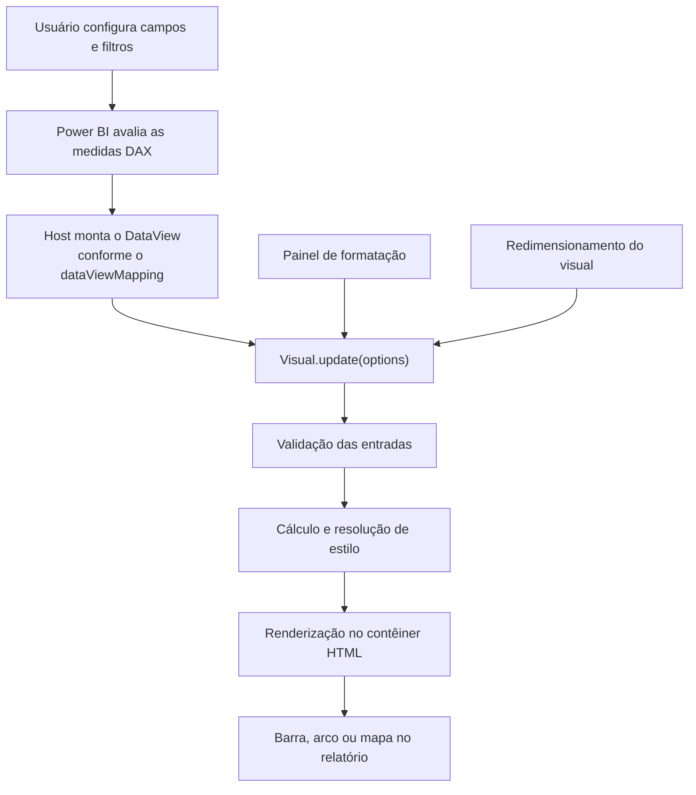

<div align="center">

&nbsp;&nbsp;&nbsp;&nbsp;

# Visuais Personalizados para Power BI

**Desenvolvimento, documentação e distribuição de visuais customizados (`.pbiviz`) para o Microsoft Power BI**


**[Documentação dos visuais](docs/README.md)** · **[Referências](Referencias.md)** · **[Autoria e licença](Autoria.md)**

</div>

---

## Sumário

1. [Apresentação](#1-apresentação)
2. [Objetivos](#2-objetivos)
3. [Visuais desenvolvidos](#3-visuais-desenvolvidos)
4. [Fundamentação técnica](#4-fundamentação-técnica)
5. [Organização do repositório](#5-organização-do-repositório)
6. [Instalação e uso](#6-instalação-e-uso)
7. [Ambiente de desenvolvimento](#7-ambiente-de-desenvolvimento)
8. [Convenções do projeto](#8-convenções-do-projeto)
9. [Limitações e considerações](#9-limitações-e-considerações)
10. [Trabalhos futuros](#10-trabalhos-futuros)
11. [Referências](#11-referências)
12. [Autoria e licença](#12-autoria-e-licença)

---

## 1. Apresentação

O Microsoft Power BI oferece um conjunto extenso de visualizações nativas, adequado
à maior parte das análises descritivas. Existem, contudo, situações em que a
representação exigida pelo negócio não encontra correspondência direta na
biblioteca padrão: uma escala que precisa permanecer fixa entre filtros, um
semáforo cujas faixas devem ser parametrizadas por quem monta o relatório, ou uma
projeção geográfica com agregação progressiva por nível de zoom.

Diante dessas lacunas, a prática comum é contornar a limitação no modelo semântico
— multiplicando medidas DAX condicionais, criando colunas auxiliares de cor ou
recorrendo a especificações Deneb replicadas manualmente em cada relatório. Essas
soluções funcionam, mas transferem complexidade para a camada de dados, dificultam
a manutenção e não são reutilizáveis entre relatórios.

Este repositório adota a alternativa oposta: **encapsular o comportamento no
próprio visual**. Cada componente é implementado como um Power BI custom visual,
distribuído como pacote `.pbiviz`, com parâmetros expostos no painel de formatação
nativo. O resultado é um artefato reutilizável, versionado e documentado, que
mantém o modelo semântico limpo e transfere a configuração para quem constrói o
relatório, sem exigir conhecimento de código.

O repositório reúne, portanto, três elementos: o **código-fonte** dos visuais, os
**pacotes compilados** prontos para importação e a **documentação técnica** de
cada componente.

---

## 2. Objetivos

### 2.1 Objetivo geral

Desenvolver, documentar e manter um acervo de visuais personalizados para o
Power BI que atenda a requisitos analíticos não cobertos pelas visualizações
nativas, priorizando a reutilização entre relatórios e a configuração sem código.

### 2.2 Objetivos específicos

1. **Encapsular a lógica de apresentação no visual**, eliminando medidas DAX
   auxiliares criadas exclusivamente para controlar cor, formato ou escala.
2. **Expor toda a parametrização no painel moderno de formatação**, de modo que a
   customização seja acessível ao analista de negócio.
3. **Garantir estabilidade de layout** sob diferentes contextos de filtro,
   preservando dimensões e alinhamento entre instâncias do mesmo visual.
4. **Documentar cada componente em dois níveis** — guia de uso para o analista e
   referência técnica para quem mantém o código.
5. **Assegurar reprodutibilidade do empacotamento**, com dependências fixadas e
   ambiente de build declarado.
6. **Manter uma base extensível** para evoluções em acessibilidade, interatividade
   e eventual submissão ao processo de certificação da Microsoft.

---

## 3. Visuais desenvolvidos

| | Visual | Descrição | Renderização | Versão | Documentação | Download |
|:---:|---|---|:---:|:---:|:---:|:---:|
|  | **Barra de Porcentagem** | Barra de progresso para percentual de atingimento, com trilho de comprimento fixo e cor definida por meta ou por cinco faixas configuráveis | Vega-Lite | `1.0.0.0` | [Abrir](docs/barraDePorcentagem/README.md) | [`.pbiviz`](visuais/barraDePorcentagem/dist/) |
|  | **Velocímetro** | Indicador radial de realizado versus meta, com faixas de desempenho, valor central formatado e ícone personalizável | SVG nativo | `1.0.0.32` | [Abrir](docs/velocimetro/README.md) | [`.pbiviz`](visuais/velocimetro/dist/) |
|  | **Map Visual** | Mapa com bolhas proporcionais, agregação progressiva por estado e cidade, seleção cruzada e tooltips enriquecidos | MapLibre GL | `1.0.0.12` | [Abrir](docs/MapVisual/README.md) | [`.pbiviz`](visuais/mapVisual/dist/) |

A documentação completa de cada visual — campos aceitos, regra de cálculo, painel
de formatação, receitas de uso, limitações e solução de problemas — está em
**[`docs/`](docs/README.md)**.

---

## 4. Fundamentação técnica

### 4.1 O modelo de visuais personalizados do Power BI

Um custom visual do Power BI é um pacote `.pbiviz` que contém código
JavaScript compilado, folha de estilo, ícone e um contrato declarativo de dados.
O host — Power BI Desktop ou Power BI Service — instancia uma classe que
implementa a interface `IVisual` dentro de um contêiner HTML isolado
(`<div>` em sandbox `iframe`), e passa a governar seu ciclo de vida.

Dois arquivos definem o contrato entre o host e o visual:

| Arquivo | Papel |
|---|---|
| `capabilities.json` | Declara os **papéis de dados** (`dataRoles`), as cardinalidades aceitas, o **mapeamento do DataView** e as **propriedades de formatação** que o painel exibirá. |
| `pbiviz.json` | Declara a **identidade do pacote**: nome interno, GUID, versão, versão da API, autor, ícone e arquivos associados. |

O fluxo de execução segue o modelo reativo do host:



O método `update()` é reinvocado a cada mudança de dado, de filtro, de propriedade
de formatação ou de viewport. Cabe ao visual ser idempotente e eficiente nesse
ponto: todo o desenho é reconstruído a partir do estado recebido, sem depender de
execuções anteriores.

### 4.2 Pilha tecnológica

| Camada | Tecnologia | Papel no projeto |
|---|---|---|
| Plataforma | **Microsoft Power BI** | Host que fornece viewport, `DataView`, serviços de tooltip e seleção, e persistência de propriedades |
| Contrato | **Power BI Visuals API 5.11.1** | Interfaces `IVisual`, `IVisualHost`, `DataView` e tipos do painel de formatação |
| Ferramental | **Power BI Visuals Tools 7.2.1** (`pbiviz`) | CLI oficial de scaffolding, servidor de desenvolvimento, validação e empacotamento |
| Linguagem | **TypeScript 5.5** | Tipagem estática sobre a API do host, ciclo de vida, cálculo e mapeamento do `DataView` |
| Marcação | **HTML5 e SVG** | Contêiner de renderização entregue pelo host; o desenho final é SVG inline, e a harness de QA do Velocímetro é uma página HTML autônoma |
| Estilo | **LESS / CSS** | Estilo do contêiner, pré-processado pelo `pbiviz` durante o empacotamento |
| Renderização declarativa | **Vega 5 e Vega-Lite 5** | Especificação declarativa compilada em SVG (Barra de Porcentagem) |
| Cartografia | **MapLibre GL** | Projeção e navegação do mapa (Map Visual) |
| Formatação | **powerbi-visuals-utils-formattingmodel 6** | Construção declarativa do painel moderno de formatação, com visibilidade condicional |
| Qualidade | **ESLint 9** + `eslint-plugin-powerbi-visuals` | Análise estática, incluindo as regras exigidas pelo processo de certificação |

### 4.3 Arquitetura comum

Os três visuais compartilham a mesma separação de responsabilidades, o que
padroniza a manutenção e permite reaproveitar decisões entre projetos:

| Camada | Arquivo | Responsabilidade |
|---|---|---|
| Contrato | `capabilities.json` | Papéis de dados, cardinalidade, mapeamento e propriedades |
| Configuração | `src/settings.ts` | Cartões, grupos, controles, valores padrão, limites e visibilidade condicional |
| Execução | `src/visual.ts` | Ciclo de vida, validação, cálculo, resolução de cor, tooltip e descarte |
| Apresentação | Vega-Lite, SVG ou MapLibre | Tradução do estado calculado em elementos gráficos |
| Estilo | `style/visual.less` | Estilo do contêiner |

A validação de entrada é sempre a primeira etapa do `update()`, e falhas são
comunicadas por mensagem textual dentro do próprio contêiner — nunca por exceção
silenciosa. As mensagens específicas de cada visual estão catalogadas na seção
*Solução de problemas* da respectiva documentação.

---

## 5. Organização do repositório

```text
powerbi-custom-visuals/
│
├── docs/                             <- Documentação de uso e referência técnica.
│   ├── README.md                     <- Índice da documentação.
│   ├── _template/                    <- Modelo para documentar um visual novo.
│   ├── barraDePorcentagem/
│   │   ├── README.md
│   │   └── img/                      <- Imagens usadas apenas nessa página.
│   ├── velocimetro/
│   └── mapVisual/
│
├── visuais/                          <- Código-fonte dos projetos individuais.
│   │
│   └── barraDePorcentagem/           <- Estrutura padrão de um projeto pbiviz.
│       ├── src/
│       │   ├── visual.ts             <- Ciclo de vida, cálculo e renderização.
│       │   └── settings.ts           <- Modelo do painel de formatação.
│       ├── style/visual.less         <- Estilo do contêiner.
│       ├── assets/icon.png           <- Ícone exibido no painel Visualizações.
│       ├── dist/                     <- Pacote .pbiviz gerado pelo empacotamento.
│       ├── capabilities.json         <- Contrato de dados e formatação.
│       ├── pbiviz.json               <- Identidade do pacote.
│       ├── package.json              <- Scripts e dependências.
│       └── tsconfig.json             <- Configuração do compilador.
│
├── LICENSE
└── README.md
```

Cada pasta em `docs/` recebe o mesmo nome da pasta correspondente em `visuais/`,
que por sua vez corresponde ao campo `visual.name` declarado no `pbiviz.json`.
Essa correspondência elimina ambiguidade entre documentação e código e evita
links quebrados por diferença de grafia ou acentuação.

---

## 6. Instalação e uso

### 6.1 Importação em um relatório

1. Acesse a pasta `dist/` do visual desejado e baixe o arquivo `.pbiviz` de maior versão.
2. No Power BI Desktop, abra o painel **Visualizações**.
3. Selecione as reticências (`...`) e a opção **Importar um visual de um arquivo**.
4. Escolha o arquivo baixado e confirme o aviso de visual não certificado.
5. O ícone do visual passa a integrar o painel de visualizações do relatório.

> [!NOTE]
> A importação tem escopo de **relatório**, não de instalação. Cada arquivo `.pbix`
> exige nova importação. Para disponibilizar um visual a toda a organização, o
> pacote deve ser publicado no **repositório de organização** por um administrador
> do Microsoft Fabric, o que também centraliza a atualização de versões.

### 6.2 Atualização de versão

Ao importar um `.pbiviz` de versão superior com o mesmo GUID, o Power BI substitui
a instância existente e preserva os campos e as propriedades já configurados. As
propriedades introduzidas na nova versão assumem seus valores padrão.

---

## 7. Ambiente de desenvolvimento

### 7.1 Requisitos

| Componente | Versão | Observação |
|---|---|---|
| Node.js | 18 ou superior | Ambiente validado em 24.18.0 |
| npm | 9 ou superior | Ambiente validado em 11.16.0 |
| Power BI Visuals Tools | 7.2.1 | Instalação global: `npm install -g powerbi-visuals-tools@7.2.1` |
| Power BI Desktop | Atual | Validação manual e importação |
| Power BI Service | — | Necessário para o **Visual de Desenvolvedor** |

### 7.2 Execução

```bash
git clone https://github.com/VieiraJulio/powerbi-custom-visuals.git
cd powerbi-custom-visuals/visuais/barraDePorcentagem

npm ci               # instalação reproduzível a partir do package-lock.json
npm run start        # servidor local de desenvolvimento
npm run lint         # análise estática
npx tsc --noEmit     # verificação de tipos
npm run package      # gera o .pbiviz em dist/
```

Com `npm run start` em execução, adicione o **Visual de Desenvolvedor** a um
relatório no Power BI Service. O host passa a consumir o bundle servido
localmente, e cada alteração salva é refletida no relatório sem reimportação.

> [!IMPORTANT]
> O Visual de Desenvolvedor exige que a opção correspondente esteja habilitada no
> portal de administração do Fabric e que o certificado local do `pbiviz` esteja
> instalado. Na primeira execução, o comando `pbiviz --install-cert` gera e instala
> esse certificado.

---

## 8. Convenções do projeto

### 8.1 Versionamento dos pacotes

A versão declarada no `pbiviz.json` segue o formato de quatro segmentos exigido
pela plataforma (`major.minor.patch.build`). Adota-se a seguinte semântica:

| Segmento | Incrementa quando |
|---|---|
| `major` | Há mudança incompatível no contrato de dados — remoção ou renomeação de papel |
| `minor` | Uma funcionalidade ou propriedade de formatação é adicionada |
| `patch` | Uma correção de comportamento é aplicada sem alterar o contrato |
| `build` | O pacote é regerado durante o ciclo de desenvolvimento |

O GUID declarado no `pbiviz.json` **não deve ser alterado** após a primeira
distribuição: é ele que permite ao Power BI reconhecer a atualização como sendo
do mesmo visual, preservando a configuração dos relatórios existentes.

### 8.2 Nomenclatura

- Pastas de projeto em `visuais/` usam *camelCase* e coincidem com `visual.name`.
- Pastas em `docs/` replicam exatamente o nome da pasta do projeto.
- Nomes de arquivos de imagem seguem o padrão numerado descrito no
  [template de documentação](docs/_template/README.md).

### 8.3 Documentação

Toda página em `docs/` segue a mesma sequência, do uso ao detalhe técnico:
apresentação, instalação, campos, regra de cálculo, painel de formatação,
receitas, limitações, solução de problemas, referência técnica, desenvolvimento,
histórico de versões e créditos. Um visual novo parte de uma cópia de
[`docs/_template/`](docs/_template/README.md).

---

## 9. Limitações e considerações

**Certificação.** Os visuais deste repositório não passaram pelo processo de
certificação da Microsoft. Visuais não certificados funcionam normalmente no
Power BI Desktop e no Service, mas não são renderizados na exportação para
PowerPoint nem em assinaturas de e-mail, e não podem acessar recursos externos
sem declaração explícita de privilégios.

**Acesso externo.** A Barra de Porcentagem e o Velocímetro declaram
`"privileges": []`, isto é, não realizam nenhuma requisição de rede. O Map Visual
declara o privilégio `WebAccess` para `https://tile.openstreetmap.org` e
`https://api.mapbox.com`, dependência que exige atenção em ambientes com
restrição de saída de rede ou política de dados sensível à telemetria de terceiros.

**Volume de dados.** O host aplica redução de dados antes de entregar o
`DataView`. O Map Visual declara um limite de 30.000 linhas; acima disso, o
conjunto é amostrado pelo próprio Power BI, e não pelo visual.

**Acessibilidade.** O Map Visual declara `supportsKeyboardFocus` e
`supportsHighlight`; o Velocímetro implementa alto contraste, rótulo ARIA e foco
visível. Na Barra de Porcentagem, esse tratamento ainda é incipiente e consta
como item da seção seguinte.

---

## 10. Trabalhos futuros

- [ ] Suporte a alto contraste e navegação por teclado na Barra de Porcentagem
- [ ] Testes automatizados de renderização, ampliando a harness manual do Velocímetro
- [ ] Remoção de dependências declaradas e não utilizadas (`d3` na Barra de Porcentagem)
- [ ] Publicação dos pacotes como *Releases* do GitHub, mantendo em `dist/` apenas a versão corrente
- [ ] Padronização de autoria e URLs de suporte nos três `pbiviz.json`
- [ ] Avaliação da submissão ao processo de certificação da Microsoft

---

## 11. Referências

As fontes consultadas no desenvolvimento — documentação normativa da plataforma,
ferramental, bibliotecas de renderização, padrões web e obras de fundamentação em
visualização de dados — estão reunidas em **[`Referencias.md`](Referencias.md)**,
no padrão ABNT NBR 6023.

---

## 12. Autoria e licença

Desenvolvido por **Julio Vieira** e **Keven Cardoso**, sob licença
[Apache-2.0](LICENSE).

A atribuição detalhada, as formas de citação (ABNT e BibTeX), as licenças das
bibliotecas de terceiros incorporadas aos pacotes, o aviso de marcas registradas
e as orientações para contribuição estão em **[`Autoria.md`](Autoria.md)**.
