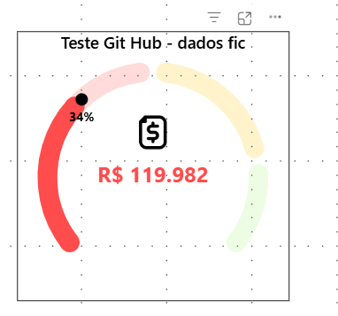

# Velocímetro

> Velocímetro de realizado versus meta, com faixas de desempenho configuráveis, valor absoluto preservado no centro e ícone personalizável — sem editar DAX.

<div align="center">


</div>

<!-- IMAGEM: recomendo recapturar em resolução maior (a atual tem 382×357 px, fica pequena como capa). Um velocímetro sozinho dentro de um cartão do relatório, com o nome do indicador visível ao lado. -->


| | |
|---|---|
| **Nome interno** | `velocimetro` |
| **Nome exibido** | `Velocímetro` |
| **Versão** | `1.0.0.32` |
| **API do Power BI** | `5.11.1` |
| **Renderização** | SVG nativo |
| **Privilégios externos** | Nenhum |
| **Pacote** | [`velocimetro...1.0.0.32.pbiviz`](../../visuais/velocimetro/dist/) |
| **Autores** | Julio Vieira e Keven Cardoso |

---

## Sumário

1. [O que é e quando usar](#1-o-que-é-e-quando-usar)
2. [Instalação no Power BI](#2-instalação-no-power-bi)
3. [Campos](#3-campos)
4. [Regra de cálculo](#4-regra-de-cálculo)
5. [Painel de formatação](#5-painel-de-formatação)
6. [Receitas](#6-receitas)
7. [Limitações conhecidas](#7-limitações-conhecidas)
8. [Solução de problemas](#8-solução-de-problemas)
9. [Referência técnica](#9-referência-técnica)
10. [Desenvolvimento](#10-desenvolvimento)
11. [Histórico de versões](#11-histórico-de-versões)
12. [Créditos](#12-créditos)

---

## 1. O que é e quando usar

O visual desenha um arco de 270 graus — de -135° a +135° — que preenche conforme o
atingimento de uma meta, com o valor realizado escrito por extenso no centro. É o
mesmo problema que a Barra de Porcentagem resolve, mas em formato radial: quando o
relatório já usa velocímetros como linguagem visual, ou quando o espaço disponível
é mais quadrado do que alongado, o arco aproveita melhor o layout do que uma barra.

O centro sempre mostra o **valor absoluto** (ex.: `R$ 119.982`), não o percentual —
essa é a informação principal do cartão. O percentual de atingimento aparece como
texto secundário, próximo ao marcador do arco. Essa escolha atende diretamente ao
tipo de leitura que um velocímetro deveria dar: "quanto foi vendido" primeiro,
"quão perto da meta" depois.

**Use quando:**

- O indicador é um valor monetário ou de contagem que precisa aparecer por extenso,
  com o atingimento de meta como informação de apoio.
- O espaço do cartão é mais próximo de um quadrado do que de um retângulo alongado.
- Você quer permitir um ícone (padrão ou PNG personalizado) identificando o indicador.

**Prefira a Barra de Porcentagem quando:**

- Várias linhas de uma matriz precisam do mesmo indicador lado a lado — a barra
  ocupa menos altura por linha.
- O que importa é o percentual, não o valor absoluto.

---

## 2. Instalação no Power BI

1. Baixe o `.pbiviz` mais recente em [`visuais/velocimetro/dist/`](../../visuais/velocimetro/dist/).
2. No Power BI Desktop, abra o painel **Visualizações**.
3. Clique nas reticências (`...`) e escolha **Importar um visual de um arquivo**.
4. Selecione o arquivo baixado e confirme o aviso de visual não certificado.
5. O ícone passa a aparecer no painel de visualizações do relatório.

> [!NOTE]
> A importação vale para o relatório atual, não para a instalação do Power BI.
> Cada `.pbix` novo precisa importar o visual de novo. Para disponibilizar o
> visual para toda a organização, o `.pbiviz` precisa ser publicado no repositório
> de organização por um administrador do Fabric.

---

## 3. Campos

| Campo | Obrigatório | Tipo aceito | O que faz |
|---|---|---|---|
| **Faturamento** | Sim | Medida numérica | Valor realizado, exibido por extenso no centro do velocímetro. |
| **Meta (opcional)** | Não | Medida numérica maior que zero | Define o valor que equivale a 100% do arco. Sem ela, o velocímetro fica no estado inicial (arco em 0%), mostrando só o valor central. |
| **Dica de ferramenta** | Não | Medida, até 20 campos | Campos adicionais exibidos ao passar o mouse sobre o arco. |

Sem o campo **Faturamento**, o visual não desenha nada e exibe a mensagem
`Adicione uma medida ao campo Faturamento.`

---

## 4. Regra de cálculo

O visual calcula dois números separados a partir de Faturamento e Meta:

```text
atingimento = Faturamento / Meta        (quando Meta > 0)
atingimento = 0                         (sem Meta, ou Meta ≤ 0)

progressoDoArco = limitar(atingimento / máximoDoArco, 0, 1)
```

O **atingimento** é o número que aparece no percentual, no tooltip e na escolha
de cor. O **progresso do arco** é só a posição gráfica do preenchimento — por
isso um atingimento de 125% desenha o arco completo (100%) sem "estourar" o
desenho, exatamente como na Barra de Porcentagem.

O que muda o `máximoDoArco` é o modo de cor escolhido no painel:

| Modo de cor | `máximoDoArco` | Efeito |
|---|---|---|
| **Faixas de desempenho** (padrão) | **Valor da meta** configurado nas faixas | O arco completa exatamente no limiar que você definir como "meta atingida" — por padrão, 100% do atingimento. |
| **Cor única** | Sempre `1` (100%) | O arco sempre completa em 100% de atingimento, independentemente das faixas configuradas no outro modo. |

| Faturamento | Meta | Atingimento | Progresso do arco |
|---|---|---|---|
| 5.000 | 10.000 | 50% | 50% do arco |
| 12.500 | 10.000 | 125% | 100% do arco (arco completo, rótulo mostra 125%) |
| 8.000 | (vazio) | — | 0% (estado inicial; sem Meta o visual não calcula atingimento) |
| Faturamento negativo | 10.000 (positivo) | 0% | 0% (o centro preserva o número negativo; atingimento e cor ficam em 0%) |
| (em branco) | 10.000 | — | Centro mostra `(Blank)`; percentual e marcador ficam ocultos |

> [!IMPORTANT]
> Sem uma **Meta** positiva, o arco não representa a magnitude do Faturamento —
> ele fica parado no estado inicial (0%). O valor central continua sendo a
> informação principal e aparece normalmente.

---

## 5. Painel de formatação

### 5.1 Velocímetro

| Propriedade | Padrão | Intervalo | Efeito |
|---|---|---|---|
| **Espessura (% do raio)** | `16,92` | 4 a 35 | Espessura do arco. |
| **Espaço entre faixas (graus)** | `12` | 0 a 24 | Espaçamento visual entre as faixas de cor do fundo. |
| **Opacidade do fundo (%)** | `20` | 0 a 100 | Opacidade do trilho de fundo (as faixas não preenchidas). |
| **Mostrar marcador** | Ligado | — | Bolinha (ou traço, nos extremos) que marca a posição exata do atingimento no arco. |
| **Cor do marcador** | `#000000` | — | Cor do marcador. |
| **Tamanho do marcador (%)** | `63,64` | 20 a 120 | Tamanho do marcador, relativo a uma referência interna do desenho. |

O marcador é uma bolinha entre 0% e 100% exclusive. Exatamente em 0%, em 100% (ou
acima) e no estado sem Meta, ele vira um pequeno traço transversal na ponta do arco.

### 5.2 Cores

| Propriedade | Padrão | Efeito |
|---|---|---|
| **Modo da barra** | Faixas de desempenho | Escolhe entre **Faixas de desempenho** (semáforo por atingimento) e **Cor única**. |

#### Faixas de desempenho — padrão

Quatro limites, avaliados sobre o **atingimento**:

| Faixa | Propriedade do limite | Valor padrão | Cor | Padrão da cor |
|---|---|---|---|---|
| Exatamente 0% | — | — | Cor para zero | `#11A3DD` |
| Até o 1º limite | Valor até o primeiro limite | `0,50` | Cor até o primeiro limite | `#FF4C4C` |
| Até o 2º limite | Valor limite segunda faixa | `0,80` | Cor segundo limite | `#FFC300` |
| Até a meta | Valor antes da meta | `1,00` | Cor antes da meta | `#A3F573` |
| Na meta | Valor da meta | `1,00` (mín. 0,01) | Cor da meta | `#22B907` |

Os limites são normalizados silenciosamente em ordem não decrescente: o 1º limite
nunca passa do valor da meta; o 2º nunca fica abaixo do 1º; o limite antes da meta
nunca fica abaixo do 2º. Se você digitar um valor fora dessa ordem, o visual ajusta
por conta própria — o painel não avisa, mas o desenho sempre respeita a ordem.

> [!NOTE]
> A cor **antes da meta** já é aplicada a partir do limite que você configurar ali
> (padrão 100%, junto com o valor da meta) — não é uma faixa "quase lá" separada
> por padrão. Se quiser uma transição visível antes da meta, abra um intervalo
> entre **Valor antes da meta** e **Valor da meta**.

#### Cor única

| Propriedade | Padrão |
|---|---|
| **Cor da barra** | `#FF4C4C` |

Nesse modo, o arco sempre completa em 100% de atingimento — o campo **Valor da
meta** do outro modo não tem efeito aqui.

### 5.3 Valor central

| Propriedade | Padrão | Intervalo | Efeito |
|---|---|---|---|
| **Mostrar valor** | Ligado | — | Exibe o Faturamento por extenso no centro. |
| **Personalizar cor por faixa** | Ligado | — | Usa uma cor própria para o texto em cada faixa de desempenho. Só aparece no modo **Faixas de desempenho**. |
| **Acompanhar cor da barra** | Ligado | — | Quando **Personalizar cor por faixa** está desligado, faz o texto seguir a mesma cor do arco. |
| **Cor personalizada** | `#333333` | — | Cor fixa do texto. Só aparece quando as duas opções acima estão desligadas. |
| **Cor do valor em zero / na 1ª / na 2ª faixa / antes da meta / na meta** | `#11A3DD` / `#FF4C4C` / `#000000` / `#000000` / `#22B907` | — | As cinco cores usadas quando **Personalizar cor por faixa** está ligado. |
| **Fonte** | Segoe UI | — | Fonte do valor central. |
| **Tamanho do texto** | `18` | 4,5 a 54 | Tamanho do valor central. |
| **Negrito** | Ligado | — | — |
| **Unidades de exibição** | Nenhuma | Nenhuma / Automático / Mil / Milhões / Bilhões | Abrevia o valor (ex.: `R$ 120 mil`). |
| **Casas decimais** | `0` | 0 a 4 | — |
| **Posição vertical (%)** | `0` | -50 a 50 | Desloca o valor central verticalmente. |

Quando o Faturamento está em branco, o centro mostra `(Blank)`.

### 5.4 Percentual

| Propriedade | Padrão | Intervalo | Efeito |
|---|---|---|---|
| **Mostrar percentual** | Ligado | — | Exibe o atingimento perto do marcador. |
| **Cor do texto** | `#000000` | — | — |
| **Fonte** | Segoe UI | — | — |
| **Tamanho do texto** | `10,5` | 4,5 a 30 | — |
| **Negrito** | Ligado | — | — |
| **Casas decimais** | `0` | 0 a 2 | — |
| **Distância do arco (px)** | `12` | 0 a 100 | Espaço entre o percentual e o arco. |

O percentual acompanha o marcador. Se houver risco de colisão com o valor central,
o texto se desloca horizontalmente e, se necessário, para baixo.

### 5.5 Ícone

| Propriedade | Padrão | Intervalo | Efeito |
|---|---|---|---|
| **Mostrar ícone** | Desligado | — | Exibe um ícone monetário no velocímetro. |
| **Mostrar botão de upload** | Desligado | — | Exibe uma engrenagem, visível só em modo de edição, para trocar o ícone padrão por um PNG. |
| **Cor do ícone padrão** | `#111111` | — | Cor do ícone monetário embutido. Fica oculta quando existe um PNG personalizado. |
| **Tamanho (% do raio)** | `28` | 8 a 70 | — |
| **Posição vertical (%)** | `-42` | -80 a 30 | — |
| **Opacidade (%)** | `100` | 0 a 100 | — |

Um PNG personalizado é aceito com estas regras: até **5 MB** de arquivo, até **40
milhões de pixels** antes do redimensionamento, redimensionado para no máximo
**128 px** no maior lado, e persistido como texto (base64) dentro do próprio
relatório — limitado a 512.000 caracteres. Nenhum arquivo é enviado para a
internet; o botão de importar só aparece em modo de edição.

### 5.6 Dica de ferramenta

| Propriedade | Padrão |
|---|---|
| **Mostrar** | Ligado |

---

## 6. Receitas

### 6.1 Faturamento e meta separados

O caso mais comum — deixe a divisão com o visual, para manter o tooltip com os
valores absolutos.

```dax
Faturamento = SUM ( fFaturamento[Valor] )

Meta Faturamento = SUM ( fMetas[Meta] )
```

Arraste `Faturamento` para **Faturamento** e `Meta Faturamento` para **Meta
(opcional)**. Mantenha o modo **Faixas de desempenho** para o semáforo automático.

### 6.2 Indicador sem meta, só para mostrar o valor

Quando não existe meta para aquele indicador, deixe o campo **Meta** vazio. O
velocímetro mostra o valor central normalmente; o arco fica no estado inicial.

```dax
Total de Chamados = COUNTROWS ( fChamados )
```

### 6.3 Semáforo com corte de negócio próprio

Quando os cortes do seu negócio não são os padrão. Exemplo com meta em 90% (e não
100%) e uma faixa intermediária mais estreita:

| Limite | Valor |
|---|---|
| Valor até o primeiro limite | `0,60` |
| Valor limite segunda faixa | `0,80` |
| Valor antes da meta | `0,90` |
| Valor da meta | `0,90` |

Lembre-se: valores em fração (`0,60` = 60%), e o visual ajusta a ordem sozinho se
algum limite ficar fora de sequência.

### 6.4 Ícone personalizado da marca

Ligue **Mostrar ícone** e **Mostrar botão de upload** em **Ícone**, publique o
relatório, entre em modo de edição e clique na engrenagem que aparece sobre o
velocímetro para importar um PNG de até 5 MB. Depois de importado, desligue de
novo **Mostrar botão de upload** para esconder a engrenagem dos usuários finais —
o ícone escolhido continua salvo no relatório.

---

## 7. Limitações conhecidas

- **Uma medida por velocímetro.** Como na Barra de Porcentagem, para várias
  linhas use o visual dentro de uma matriz ou replique o objeto.
- **O arco não passa de 100%.** O excedente aparece só no percentual e no valor
  central, nunca no desenho.
- **Sem meta, o arco não representa o Faturamento.** Ele fica no estado inicial
  até uma meta positiva ser configurada.
- **Viewports muito pequenos escondem elementos.** Abaixo de 48 × 42 px o visual
  mostra `Aumente o tamanho do visual.`; com o raio externo abaixo de 34 px, o
  ícone e o percentual somem para preservar a legibilidade do essencial.
- **Sem seleção cruzada.** Clicar no velocímetro não filtra outros visuais.
- **Máximo de 20 campos** na dica de ferramenta.
- **Visual não certificado.** Funciona no Power BI Desktop e Service, mas não
  aparece em exportação para PowerPoint nem em assinaturas por e-mail.

---

## 8. Solução de problemas

| O que aparece | Causa | Correção |
|---|---|---|
| `Adicione uma medida ao campo Faturamento.` | O campo obrigatório está vazio. | Arraste uma medida numérica para **Faturamento**. |
| `O Faturamento possui um valor inválido.` | A medida devolveu um valor não numérico ou infinito. | Trate a medida com `DIVIDE()` ou `COALESCE()` para evitar erros de divisão por zero ou blank inesperado. |
| `Aumente o tamanho do visual.` | O cartão ficou menor que 48 × 42 px. | Redimensione o visual no relatório. |
| `Não foi possível renderizar o velocímetro.` (ou mensagem semelhante) | Falha inesperada na renderização. | Remova e adicione o visual de novo. Persistindo, abra uma issue no repositório com o print e o passo a passo. |
| Arco parado em 0% mesmo com Faturamento preenchido | O campo **Meta** está vazio, ou a medida de meta devolveu zero/negativo. | Preencha **Meta (opcional)** com uma medida positiva, ou verifique se existe meta cadastrada para o período filtrado. |
| Centro mostra `(Blank)` | O Faturamento ficou em branco no contexto de filtro atual. | Confira se a medida tem valor para a combinação de filtros selecionada; use `COALESCE()` se branco não for o resultado esperado. |
| Ícone/percentual somem | O visual ficou pequeno demais (raio externo abaixo de 34 px). | Aumente o tamanho do cartão. |
| Engrenagem de importar ícone não aparece | **Mostrar ícone** e/ou **Mostrar botão de upload** estão desligados, ou o relatório não está em modo de edição. | Ligue os dois no painel de formatação e entre em modo de edição. |

---

## 9. Referência técnica

### 9.1 Arquitetura

| Camada | Responsabilidade |
|---|---|
| **Power BI Host** | Viewport, `DataView`, cultura, paleta de alto contraste, serviço de tooltip, persistência de propriedades. |
| **Contrato** | `capabilities.json` define papéis de dados, cardinalidade, tooltip e propriedades de formatação. |
| **Configuração** | `src/settings.ts` declara seis cartões, controles, padrões, limites e visibilidade condicional. |
| **Execução** | `src/visual.ts` agrega dados, calcula o atingimento, resolve cores, formata valores, controla acessibilidade e o ciclo de vida. |
| **Gráfica** | SVG nativo desenha arcos, marcador, textos e ícone diretamente no contêiner do Power BI — sem Vega, Vega-Lite ou D3. |
| **QA** | `qa/preview.html` instancia a classe compilada com um host simulado, para testes visuais manuais. |

```text
Usuário configura o relatório
  ↓
Power BI calcula Faturamento, Meta e medidas de tooltip
  ↓
DataView entrega os valores ao visual
  ↓
Visual.update() lê dados, viewport e formatação
  ↓
Cálculo do atingimento e do progresso do arco
  ↓
Seleção das faixas, cores e formatos
  ↓
Renderização SVG responsiva
  ↓
Valor central, percentual, marcador, ícone e tooltip no relatório
```

O arco vai de -135° a +135° (270° no total). O visual mantém dois números
separados — atingimento e progresso do arco — na mesma lógica de recorte usada na
Barra de Porcentagem:

```typescript
progressoDoArco = limitar(atingimento / máximoDoArco, 0, 1)
```

Acessibilidade: o SVG usa `role="img"`, `tabindex="0"` e `aria-label` construído
a partir do Faturamento, da Meta e do atingimento formatados (ex.: *"Faturamento:
R$ 119.982. Meta: R$ 350.000. Atingimento: 34,3%."*). O modo de alto contraste do
Power BI substitui as cores do arco pela cor de primeiro plano fornecida pelo
host. Mensagens de estado usam `role="status"`; o feedback do upload de ícone usa
`aria-live="polite"`.

### 9.2 Estrutura do projeto

```text
velocimetro/
├── assets/
│   └── icon.png
├── dist/
│   └── velocimetro...1.0.0.32.pbiviz
├── qa/
│   └── preview.html
├── src/
│   ├── settings.ts
│   └── visual.ts
├── style/
│   └── visual.less
├── capabilities.json
├── eslint.config.mjs
├── package.json
├── package-lock.json
├── pbiviz.json
├── README.md
└── tsconfig.json
```

| Arquivo | Papel |
|---|---|
| `src/visual.ts` | Ciclo de vida, dados, agregação, cálculo, SVG, marcador, rótulos, tooltip, ARIA e importação do ícone. |
| `src/settings.ts` | Cartões e controles do painel Formatar, padrões, limites e visibilidade condicional. |
| `capabilities.json` | Contrato entre o Power BI e o visual. |
| `pbiviz.json` | Identidade, versão, API, autor, ícone, estilo e arquivos associados. |
| `qa/preview.html` | Laboratório manual baseado no bundle real de produção. |
| `dist/` | Artefatos de empacotamento; contém também versões anteriores. |

### 9.3 Dependências

| Pacote | Papel |
|---|---|
| `powerbi-visuals-api` | Contratos de integração com o host. |
| `powerbi-visuals-utils-formattingmodel` | Painel moderno de formatação. |
| `powerbi-visuals-utils-formattingutils` | Formatação de medidas e unidades de exibição. |
| `typescript` | Linguagem principal. |
| `eslint` + `eslint-plugin-powerbi-visuals` | Análise estática. |

Renderizador: **SVG nativo** — o runtime não depende de Vega, Vega-Lite, Deneb ou D3.

### 9.4 Mapeamento de dados

| Papel | Mínimo | Máximo |
|---|---|---|
| `actual` (Faturamento) | 1 | 1 |
| `target` (Meta) | 0 | 1 |
| `tooltip` | 0 | 20 |

`capabilities.json` declara `"privileges": []` (nenhum acesso externo) e
`"supportsEmptyDataView": true`.

---

## 10. Desenvolvimento

**Pré-requisitos:** Node.js 18 ou superior, npm, `powerbi-visuals-tools` e o
Power BI Desktop para validação manual.

```bash
cd visuais/velocimetro

npm ci               # instalação reproduzível
npm run start        # servidor local para o Visual de Desenvolvedor
npm run lint         # análise estática
npx tsc --noEmit     # verificação de tipos
npm run package      # gera o .pbiviz em dist/
```

Se o `pbiviz` não estiver disponível globalmente:

```bash
npm install -g powerbi-visuals-tools@7.2.1
```

Com `npm run start` ativo, adicione o **Visual de Desenvolvedor** a um relatório
no Power BI Service para validar o código quase em tempo real. `qa/preview.html`
oferece um laboratório manual adicional, fora do fluxo do Power BI.

---

## 11. Histórico de versões

| Versão | Mudanças |
|---|---|
| `1.0.0.32` | Versão atual. Seis cartões de formatação, três modos de cor (faixas, cor única, com cor por faixa opcional no valor central), ícone monetário com upload de PNG persistido no relatório, acessibilidade (ARIA, alto contraste, foco visível) e QA manual via `qa/preview.html`. |
| `1.0.0.0` – `1.0.0.31` | Iterações de empacotamento e ajuste fino de valores padrão (espessura, tamanho do marcador, tamanho de fonte do valor central, entre outros). Sem changelog detalhado por versão — os pacotes intermediários ficam disponíveis em [`dist/`](../../visuais/velocimetro/dist/) para quem precisar comparar. |

---

## 12. Créditos

Desenvolvido por **Julio Vieira** e **Keven Cardoso**.

Licenciado sob [Apache-2.0](../../LICENSE).
